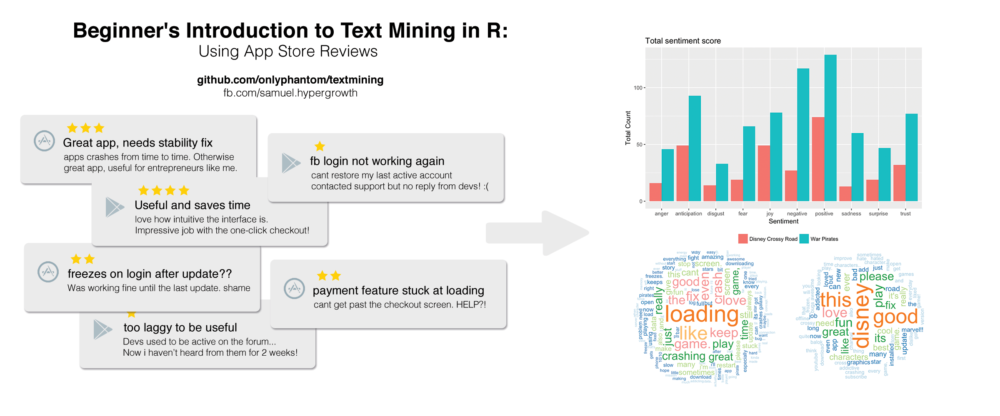

# Beginner\'s Introduction to Text Mining: An App Store Reviews Exercise
This notebook is written as a workshop material for a session by [Plug and Play Indonesia](http://apac.plugandplaytechcenter.com/indonesia/). The workshop is part of a series that serve as an introduction to data science and machine learning, and its intended audience are novices as well as junior professionals in the field of data science. Plug and Play is an accelerator for mobile startups, and as such, I have chosen to show application of text mining techniques and capabilities in processing app store reviews. 

# Challenge
I work for the company [HyperGrowth](https://hypergrowth.co), and among other things, we develop automation tools for mobile app businesses. One of our product is [GrowthBot](http://growthbot.ai), a free automation chatbot that deliver growth metrics, app reviews, and performance scorecards to mobile marketers. Our customers use GrowthBot to better analyze and manage (_reply to_) user reviews of their apps, and the advantages are plenty: accurate market feedback, faster product iteration, and an unparalled timeliness in responding to users' needs and feedback. This notebook aims to unpack some of these concepts and show how we can utilize R and some simple text mining packages to:

* Process text retrieve from a web service endpoint   
    + Converting JSON to R
* Data cleansing and content transformation techniques  
    + Compare pre- and post-processed data
* Find the top 10 most frequent keywords  
    + Easily find keywords that appear >100 times  
* Generate a wordcloud  
* Extracts sentiment  
    + Visualize sentiment  
    + Compare sentiment(s) between 2 apps using ggplot  
* Checking corrrelations between words  
* Custom stopwords, custom content transformer and the role of domain knowledge  

## Pre-requisite and Dependencies

1. `jsonlite` - Convert JSON data into R objects  
2. `tm` - A text mining package. [Comprehensive documentation here](http://cran.r-project.org/web/packages/tm/vignettes/tm.pdf)  
3. `SnowballC` - Word stemming  
4. `syuzhet` - Extracting sentiments  
5. `wordcloud` - Generate wordcloud (surprised?)  
6. `ggplot2` - Data visualization based on the grammar of graphics. [A ggplot2 cheatsheet, also by me](https://github.com/onlyphantom/ggplot2cheatsheet)  

Data endpoint: http://bot.hypergrowth.co:3005/reviews 
Courtesy of the bot development team at [HyperGrowth](https://hypergrowth.co) 

# Project structure
The project is completed using R notebook, and exported to both HTML and PDF. All three files (Rmd, HTML and PDF) are available in this repo. 

## Updates
I have since left the team at HyperGrowth and GrowthBot (GrowthBot's tech is sold to one of our investors and our customer-facing APIs / apps are no longer in service). My email is now inactive. I'm working at [Algoritma](https://algorit.ma) as a course producer teaching an ever larger community about R programming, Python programming, NLP, Machine Learning and Visualization. Connect with me on [Facebook](https://www.facebook.com/onlyphantom) or on [my LinkedIn](https://www.linkedin.com/in/chansamuel/) page instead. 

Enjoy programming!
